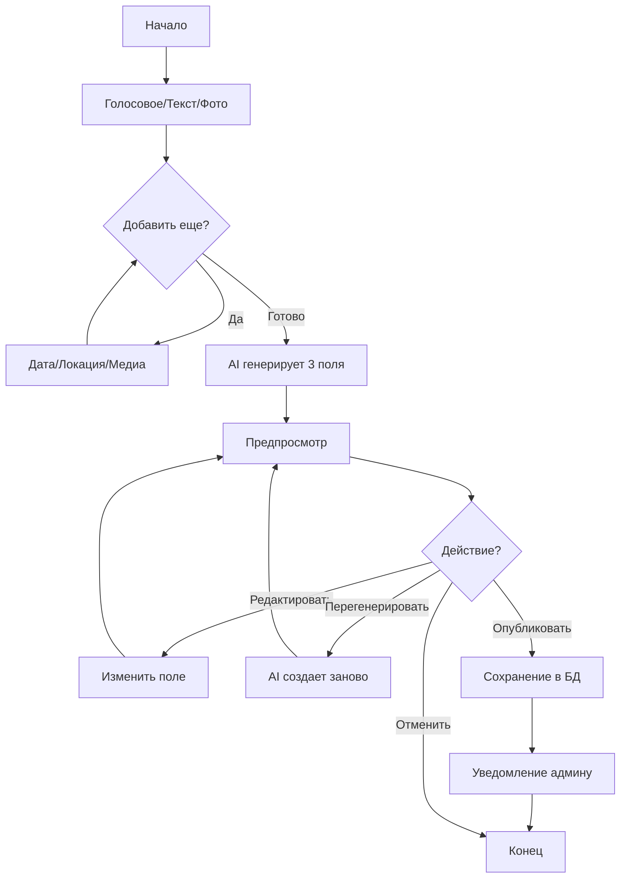

# Обновление Telegram бота для новостей

## Дата обновления: 04.02.2026

## Обзор изменений

Telegram бот был существенно модернизирован для поддержки голосовых сообщений, AI-генерации структурированного контента, и улучшенного пользовательского интерфейса.

## Новые возможности

### 1. 🎤 Поддержка голосовых сообщений

- Автоматическое распознавание речи через OpenAI Whisper API (через OpenRouter)
- Поддержка русского языка
- Транскрибация сохраняется и объединяется с текстовыми сообщениями
- Можно отправлять несколько голосовых сообщений для одной новости

**Использование:**
1. Отправьте голосовое сообщение боту
2. Бот распознает речь и покажет текст
3. Продолжайте добавлять материалы или нажмите "✅ Готово"

### 2. 📰 AI-генерация структурированного контента

AI автоматически создает три поля из любого текста:
- **Название** (title) - краткий заголовок 5-10 слов
- **Краткое описание** (shortDescription) - 1-2 предложения, до 200 символов
- **Расширенное описание** (fullDescription) - 3-5 абзацев, минимум 300 слов

AI учитывает:
- Источник текста (голосовое/текстовое)
- Дату и локацию мероприятия
- Количество фото и видео
- Специализацию клиники (маммология, вакуумная биопсия)

### 3. ✏️ Предпросмотр и редактирование

После генерации AI показывает предпросмотр с кнопками:
- **✅ Опубликовать** - создать черновик как есть
- **✏️ Название** - изменить название
- **✏️ Краткое** - изменить краткое описание
- **✏️ Полное описание** - изменить полное описание
- **🔄 Перегенерировать** - попросить AI создать заново
- **❌ Отменить** - отменить создание новости

### 4. 📅📍 Ручное указание даты и локации

Новые команды:
- `/date ДД.ММ.ГГГГ` - установить дату мероприятия (например: `/date 15.02.2026`)
- `/location координаты` - установить координаты (например: `/location 55.751244,37.618423`)
- `/location адрес` - геокодинг через Yandex API (например: `/location Москва, ул. Тверская 1`)

Если дата и локация не указаны вручную, бот пытается извлечь их из EXIF данных фотографий.

### 5. 📷 Групповая загрузка фото

- Telegram автоматически группирует несколько фото, отправленных одновременно
- Бот распознает медиа-группы и корректно их обрабатывает
- После завершения группы показывает сообщение с кнопками

### 6. 🎯 Улучшенный UX с inline-кнопками

**Этап 1: Сбор материалов**
- ✅ Готово
- 📅 Указать дату
- 📍 Указать локацию
- ❌ Отменить

**Этап 2: Предпросмотр AI-контента**
- ✅ Опубликовать
- ✏️ Редактирование полей
- 🔄 Перегенерировать
- ❌ Отменить

## Технические изменения

### Новые зависимости

```json
"dependencies": {
  "form-data": "^4.0.0"
}
"devDependencies": {
  "@types/form-data": "^4.0.0"
}
```

### Измененные файлы

1. **package.json** - добавлены зависимости
2. **src/lib/telegram-bot.ts** - основная логика бота
   - Обновлен интерфейс `PendingNews`
   - Добавлены функции:
     - `handleVoiceMessage()` - обработка голосовых сообщений
     - `handleDateCommand()` - команда /date
     - `handleLocationCommand()` - команда /location
     - `showAIPreview()` - показ предпросмотра
     - `publishNewsFromPreview()` - публикация после подтверждения
     - `handleEditFieldText()` - редактирование полей
     - `regenerateAIContent()` - перегенерация AI
   - Обновлена `finishNewsCreation()` - теперь показывает предпросмотр
   - Добавлена группировка медиа по `media_group_id`

3. **src/lib/openrouter.ts**
   - Добавлена `transcribeAudioWithAI()` - транскрибация через Whisper
   - Обновлена `expandTextWithAI()` - улучшенный промпт для генерации трех полей
   - Добавлен контекст: голосовой ввод, локация, дата

4. **src/lib/file-utils.ts**
   - Добавлена `geocodeLocation()` - геокодирование через Yandex API

5. **src/app/api/telegram/webhook/route.ts**
   - Добавлена обработка голосовых сообщений
   - Добавлена обработка команд /date и /location
   - Добавлена обработка новых callback_data:
     - `finish_news`, `cancel_news`
     - `set_date`, `set_location`
     - `publish_news`
     - `edit_title`, `edit_short`, `edit_full`
     - `regenerate_ai`

### Структура данных

```typescript
interface PendingNews {
  chatId: number;
  messageId: number;
  text?: string;
  images: Array<{ fileId: string; path?: string }>;
  videos: Array<{ fileId: string; path?: string }>;
  date: Date;
  startedAt: Date;
  manualDate?: Date;
  manualLocation?: {
    latitude: number;
    longitude: number;
    address?: string;
  };
  mediaGroupId?: string;
  mediaGroupTimeout?: NodeJS.Timeout;
  voiceTranscriptions: string[];
  aiGenerated?: {
    title: string;
    shortDescription: string;
    fullDescription: string;
  };
  waitingForEdit?: 'title' | 'short' | 'full' | null;
}
```

## Переменные окружения

Необходимые переменные (уже должны быть в `.env`):
- `OPENROUTER_API_KEY` - для AI (транскрибация + генерация контента)
- `TELEGRAM_BOT_TOKEN` - токен бота
- `TELEGRAM_ADMIN_CHAT_ID` - ID чата администратора
- `YANDEX_GEOCODER_API_KEY` - для геокодирования адресов (опционально)

## Установка зависимостей

```bash
bun install
```

## Примеры использования

### Пример 1: Голосовое сообщение + фото с редактированием

1. Пользователь отправляет голосовое: "Сегодня прошло обучение по вакуумной биопсии"
2. Бот: "🎤 Распознаю голосовое сообщение..."
3. Бот: "✅ Текст распознан: Сегодня прошло обучение..."
4. Пользователь отправляет 5 фото (группой)
5. Бот: "📷 Группа фото добавлена (всего: 5). Что дальше?" [Кнопки]
6. Пользователь нажимает "✅ Готово"
7. Бот: "⏳ Генерирую новость с помощью AI..."
8. Бот показывает предпросмотр с тремя полями
9. Пользователь нажимает "✏️ Название"
10. Пользователь отправляет: "Мастер-класс по вакуумной биопсии"
11. Бот: "✅ Название обновлено!" + обновленный предпросмотр
12. Пользователь нажимает "✅ Опубликовать"
13. Бот: "⏳ Сохраняю новость..."
14. Бот: "✅ Новость создана как черновик!"

### Пример 2: Текст + фото с ручной датой и локацией

1. Пользователь: "Обучение врачей"
2. Бот показывает кнопки
3. Пользователь отправляет 3 фото
4. Пользователь: `/date 20.02.2026`
5. Бот: "✅ Дата мероприятия установлена: 20.02.2026"
6. Пользователь: `/location Москва, ул. Ленина 10`
7. Бот: "🔍 Поиск координат по адресу..."
8. Бот: "✅ Локация установлена: Москва, ул. Ленина, 10..."
9. Пользователь нажимает "✅ Готово"
10. AI генерирует контент с учетом даты и локации
11. Пользователь сразу нажимает "✅ Опубликовать"

### Пример 3: Только голосовое без фото

1. Голосовое: "Завтра семинар в центре города"
2. Бот распознает текст
3. `/date 05.02.2026`
4. `/location 55.751244,37.618423`
5. "✅ Готово"
6. AI генерирует контент
7. "✅ Опубликовать"

## Workflow создания новости



## Безопасность

- Ограничение размера голосовых файлов (max 20 MB через Telegram API)
- Валидация координат (широта: -90 до 90, долгота: -180 до 180)
- Валидация формата даты
- Rate limiting на стороне OpenRouter

## Известные ограничения

- Голосовые сообщения: максимальная длина определяется Telegram API
- Whisper API: распознает только речь, не музыку или фоновые звуки
- Геокодирование: требует API ключ Yandex (если не указан, координаты нужно вводить вручную)
- AI генерация: качество зависит от детальности исходного текста

## Поддержка

При проблемах проверьте:
1. Переменные окружения в `.env`
2. Логи бота в консоли (префикс `[BOT]`, `[AI]`, `[FILE]`, `[WEBHOOK]`)
3. Баланс OpenRouter API
4. Webhook настроен на правильный URL

## Roadmap (будущие улучшения)

- [ ] Поддержка audio файлов (не только voice)
- [ ] Пакетная обработка новостей
- [ ] История редактирований
- [ ] Предпросмотр изображений в Telegram перед публикацией
- [ ] Автоматическая категоризация новостей
- [ ] Мультиязычная поддержка
